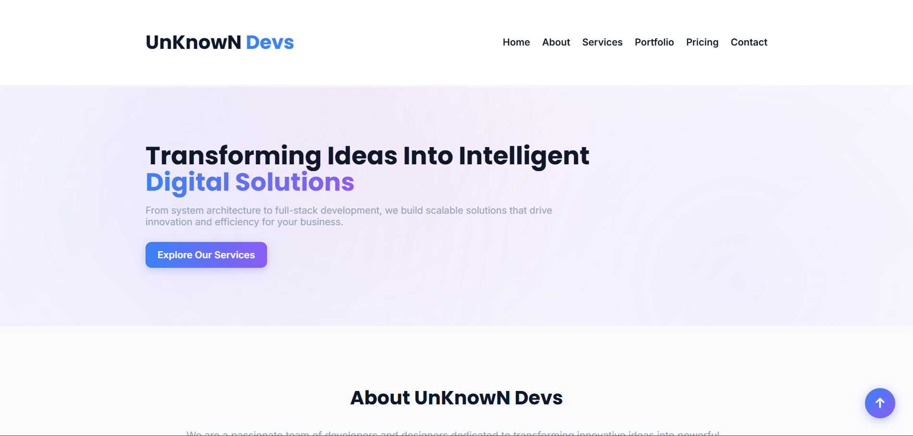

# Lab 5: Responsive Web Page with CSS Grid

## 🎯 Project Overview

This lab demonstrates a fully responsive web page for **UnKnowN Devs** - a freelance digital solutions company. The project showcases modern web design techniques including CSS Grid, media queries, smooth transitions, dark mode, and comprehensive accessibility features.

## 🚀 Features

### Core Features
- **Responsive CSS Grid Layout**: 3-column grid on desktop, 2-column on tablet, 1-column on mobile
- **Smooth Scroll Navigation**: CSS-only smooth scrolling between sections
- **Hover Effects & Transitions**: Interactive service cards with scale and shadow effects
- **Mobile-First Design**: Fully responsive across all device sizes
- **Enhanced Accessibility**: 
  - ARIA labels and roles throughout
  - Keyboard navigation support
  - Focus indicators for all interactive elements
  - Screen reader optimized
  - Skip links for main content
- **SEO Optimized**: 
  - Open Graph meta tags for social sharing
  - Twitter Card meta tags
  - Rich meta descriptions and keywords
  - Semantic HTML structure
- **CSS-Only Mobile Menu**: Hamburger menu with backdrop overlay (click overlay or X to close)

### Sections
1. **Header**: Sticky navigation with mobile hamburger menu (CSS-only)
2. **Hero Section**: Animated gradient background with call-to-action button
3. **About Section**: Company story with value propositions (Innovation, Quality, Support)
4. **Stats Section**: Key metrics display with gradient background
5. **Services Section**: 6 service cards in a responsive grid with staggered animations
   - Frontend Design
   - Backend Development
   - SEO Optimization
   - Website Maintenance
   - E-Commerce Solutions
   - UI/UX Design
6. **Portfolio Section**: 2 project showcases with tech stack tags and image zoom effects
7. **Testimonials Section**: 3 client reviews with avatar images
8. **Contact Section**: Contact form and information sidebar
9. **Footer**: Quick links, contact info, and social media links

## 🛠️ Technologies Used

- **HTML5**: Semantic markup with ARIA attributes
- **CSS3**: 
  - CSS Grid
  - Flexbox
  - Media Queries
  - CSS Transitions & Animations
  - CSS Variables (Custom Properties)
- **Google Fonts**: Poppins & Inter
- **Font Awesome 6.5.1**: Icons for services and social media
- **No JavaScript**: Pure CSS implementation

## 📂 Project Structure

```
LabFive/
├── index.html          # Main HTML with ARIA and SEO tags
├── styles.css          # CSS with Grid, animations, responsive design
└── README.md           # This file
└── image.png           # Preview Image
```

## 🔗 Live Links

- **GitHub**: [https://github.com/Unknown-086](https://github.com/Unknown-086)
- **LinkedIn**: [https://www.linkedin.com/in/abdul-hadi86/](https://www.linkedin.com/in/abdul-hadi86/)
- **X (Twitter)**: [https://x.com/UnKnown_0_86](https://x.com/UnKnown_0_86)
- **Portfolio**: [https://unknown-086.github.io/Portfolio/](https://unknown-086.github.io/Portfolio/)

## 📸 Preview



**Abdul Hadi (UnKnowN)**
- GitHub: [@Unknown-086](https://github.com/Unknown-086)

